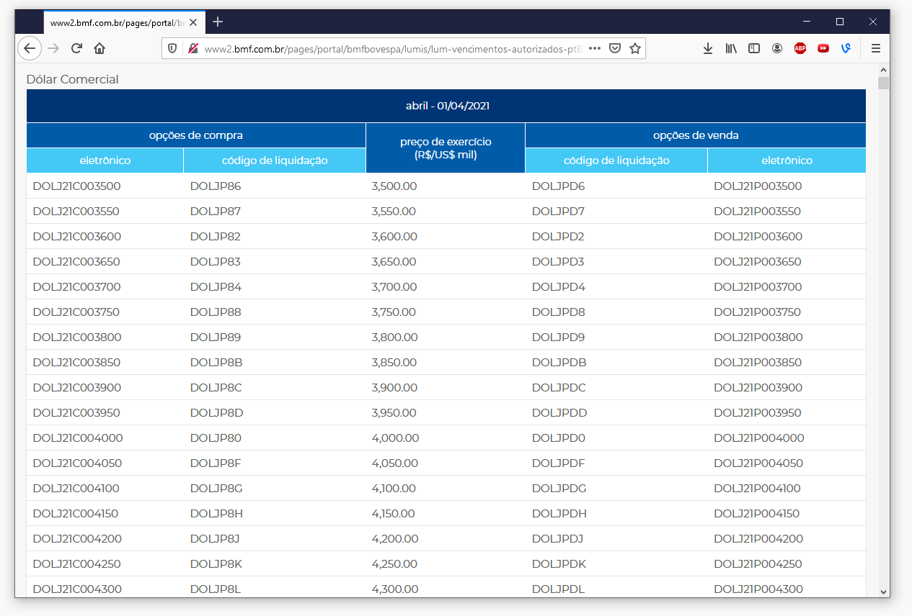
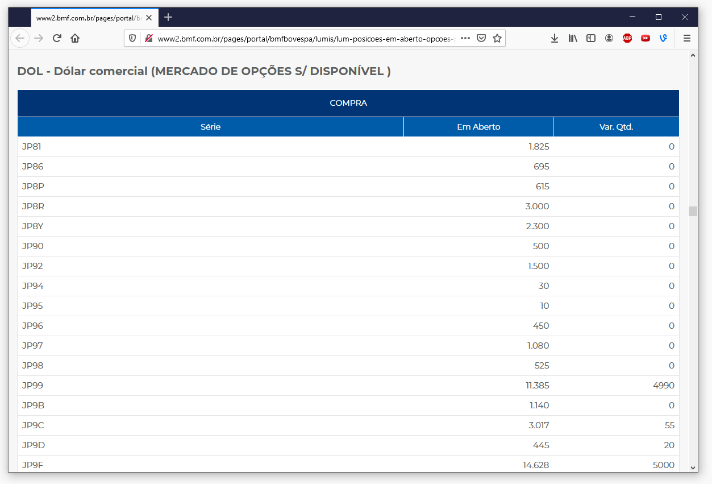
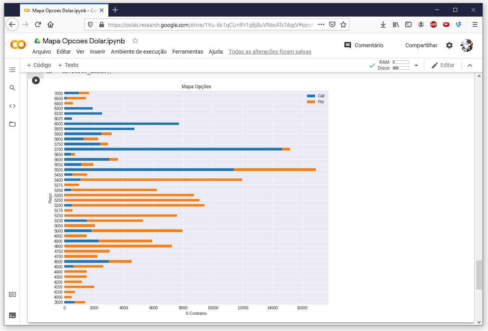
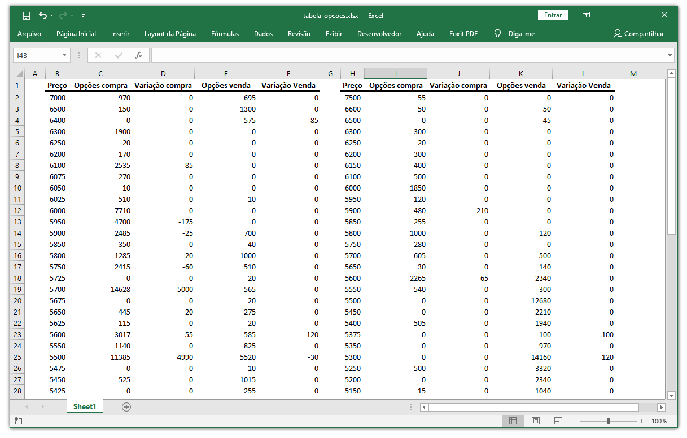

## Mapa de Opções Dólar Comercial

Esse projeto facilita a visualização das informações extraídas no site da B3.
Na hora de fazer um pré-market, é interessante analisarmos as posições de opções abertas.
 
O problema é que isso é um tanto repetitivo e pode gerar alguns erros, portanto, decidi criar um pequeno projeto que pega as informações do site da B3, forma um gráfico das posições e depois é armazenado num arquivo do Excel.
 
Vamo lá:

### Pegando os codigos das opções

### Pegando os strikes referentes ao codigo

### Plotando no grafico

### Criando e populando planilha no Excel

